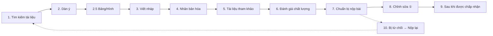

# Kỹ năng Viết Bài báo Khoa học (Paper Writer Skill)

Một kỹ năng dành cho Antigravity hỗ trợ viết bài báo khoa học/y khoa. Bao quát toàn bộ vòng đời của một bản thảo từ tìm kiếm tài liệu đến khi sẵn sàng nộp, phản hồi bình duyệt, và xử lý khi bị từ chối.

> **English version → [README.md](README.md)**

## Tổng quan

Một luồng công việc gồm **10 giai đoạn** tự động tạo và quản lý thư mục dự án theo định dạng IMRAD với các tệp Markdown được cấu trúc sẵn, ma trận tài liệu, và danh sách kiểm tra chất lượng.



## Cài đặt

Sao chép kho lưu trữ này vào không gian làm việc Antigravity của bạn:

```bash
git clone https://github.com/bryanphandhy/paper-writer-skill-antigravity.git
```

Kỹ năng này dựa vào khả năng của không gian làm việc Antigravity. Khi đã được sao chép, Antigravity sẽ tự động có thể đọc và sử dụng luồng công việc `SKILL.md` khi bạn yêu cầu nó giúp viết một bài báo.

## Yêu cầu

- CLI của [Antigravity](https://gemini.ai/code)
- search_web / read_url_content / mcp_Consensus_search (được sử dụng cho tìm kiếm tài liệu)
- Python 3 + numpy, pandas, scipy, statsmodels, lifelines, matplotlib (cho các kịch bản phân tích dữ liệu)

## Các loại bài báo được hỗ trợ

| Loại | Cấu trúc | Hướng dẫn Báo cáo |
|------|-----------|---------------------|
| **Bài báo Gốc (Original Article)** | Full IMRAD | STROBE / CONSORT |
| **Báo cáo Ca bệnh (Case Report)** | Intro / Case / Discussion | CARE |
| **Bài Tổng quan (Review Article)** | Thematic sections | — |
| **Tổng quan Hệ thống (Systematic Review)** | PRISMA-compliant | PRISMA 2020 |
| **Thư gửi Tòa soạn (Letter / Short Communication)** | Condensed IMRAD | Tương tự bài báo gốc |
| **Đề cương Nghiên cứu (Study Protocol)** | SPIRIT-compliant | SPIRIT 2025 |

## Các Phiên bản

- **v4.0.0** (2026-04-20) — Tích hợp hệ thống Antigravity, Consensus MCP, và hỗ trợ hoàn toàn tiếng Việt.
- **v3.2.0** (2026-03-05) — Quản lý thư mục dự án nghiên cứu: tái cấu trúc toàn diện
- **v3.1.0** (2026-03-05) — Hệ thống tự động: 8 cổng đánh giá chất lượng tự động

Xem [CHANGELOG.md](CHANGELOG.md) để biết thêm chi tiết.
